# Component Properties
Karena React component merupakan fungsi JavaScript, kita dapat memberikan parameter ketika menggunakannya. Namun, React component hanya dapat menerima satu parameter--berupa objek--yang biasa kita sebut dengan properties (props).

sayHello Component
```
function SayHello(props) {
  const name = props.name;
  const company = props.company;
 
  return (
    <p>
      Hello, {name} from {company}!
    </p>
  );
}
```

penggunaannya:
```
<SayHello name="Bill" company="Microsoft" />; // <p>Hello, Bill from Microsoft!</p>
<SayHello name="Steve" company="Apple" />; // <p>Hello, Steve from Apple!</p>
<SayHello name="Mark" company="Facebook" />; // <p>Hello, Mark from Facebook!</p>
```

Melalui props yang ditunjukkan kode di atas, kita dapat mengirimkan data ketika menggunakannya. Hal inilah yang membuat component sangat reusable karena hanya dengan satu component--beserta properti yang terdefinisikan--kita dapat menampilkan UI serupa dengan data yang berbeda.

### Beberapa Best Practice ketika membuat dan menggunakan properti

Hampir seluruh tipe data di JavaScript dapat dikirimkan melalui props. Namun, terdapat best practice dalam menetapkan properti yang penting untuk Anda ikuti. 

Best practice yang pertama adalah ***hindari penggunaan JavaScript object*** ketika mengirimkan data pada properti component.

Contohnya seperti ini:

```
function InstagramProfile(props) {
  const profile = props.profile;
  const name = profile.name;
  const username = profile.username;
  const bio = profile.bio;
  const isVerified = profile.isVerified;

  return (
    <div className="container">
      <dl>
        <dt>Name: </dt>
        <dd>{name}</dd>
        <dt>Username: </dt>
        <dd>{username}</dd>
        <dt>Bio: </dt>
        <dd>{bio}</dd>
        <dt>Verified: </dt>
        <dd>{isVerified ? 'yes' : 'no'}</dd>
      </dl>
    </div>
  );
}
 
const profile = {
  name: 'Dicoding Indonesia',
  username: 'dicoding',
  bio: 'Bangun Karirmu Sebagai Developer Profesional',
  isVerified: true
};
 
<InstagramProfile profile={profile} />; // sebisa mungkin, hindari praktik seperti ini
```

Oke, mungkin menggunakan objek sebagai “pembungkus” data terlihat lebih mudah karena kita hanya perlu mendefinisikan satu properti saja pada component yaitu profile. Namun, hal ini lah yang menyebabkan kontrak dalam penggunaan component tersebut tidak jelas. Sebab JavaScript merupakan bahasa yang tidak terikat dengan tipe data (weakly typed) sehingga praktik seperti ini sebaiknya dihindari.

**Alih-alih mengirimkan props dalam bentuk objek, sebaiknya definisikanlah propertinya satu per satu. Sehingga, kita tak lagi mengirimkan objek, melainkan** ***cukup dengan nilai primitif seperti string, number, atau boolean.***

```
function InstagramProfile(props) {
  const name = props.name;
  const username = props.username;
  const bio = props.bio;
  const isVerified = props.isVerified;
 
  return (
    <div className="container">
      <dl>
        <dt>Name: </dt>
        <dd>{name}</dd>
        <dt>Username: </dt>
        <dd>{username}</dd>
        <dt>Bio: </dt>
        <dd>{bio}</dd>
        <dt>Verified: </dt>
        <dd>{isVerified ? 'yes' : 'no'}</dd>
      </dl>
    </div>
  );
}
 
<InstagramProfile
  name="Dicoding Indonesia"
  username="dicoding"
  bio="Bangun Karirmu Sebagai Developer Profesional"
  isVerified // pemberian nilai boolean "true" cukup dengan menuliskan nama properti tanpa nilai apa pun
/>;
```

Dengan cara ini, kontrak dalam menggunakan component akan lebih terlihat lebih jelas. Selain itu, secara tidak langsung kita juga sudah menerapkan prinsip least privilege guna menghindari dalam mengirimkan data yang sebenarnya tidak diperlukan.

**Best practice** lainnya adalah selalu gunakan fitur ES6 agar sintaksis yang dituliskan lebih bersih, singkat, dan mudah dibaca. Contohnya pada komponen InstagramProfile, kita dapat menggunakan **object destructuring** dalam mengakses nilai propertinya. Sehingga, kita tidak perlu menuliskan kode satu per satu dalam membuat variabel lokal yang menampung nilai dari props.


```
function InstagramProfile({ name, username, bio, isVerified }) {
  return (
    <div className="container">
      <dl>
        <dt>Name: </dt>
        <dd>{name}</dd>
        <dt>Username: </dt>
        <dd>{username}</dd>
        <dt>Bio: </dt>
        <dd>{bio}</dd>
        <dt>Verified: </dt>
        <dd>{isVerified ? 'yes' : 'no'}</dd>
      </dl>
    </div>
  );
}
```

Terakhir, ketika menggunakan nilai properti, tanamkan di pikiran Anda bahwa properti bersifat **read-only** alias **hanya boleh dibaca dan tidak boleh diubah nilainya**. React component harus bersifat pure, salah satunya dengan tidak mengubah nilai yang diberikan melalui sebuah parameter atau properti. Hal ini sama seperti prinsip pure function pada functional programming. Jika di dalam component Anda menuliskan kode yang mengubah nilai dari properti, silakan evaluasi kode tersebut. Pastikan Anda tidak melakukan perubahan pada nilainya.

#### Catatan: 
UI aplikasi memang bersifat dinamis dan seringkali berubah seiring terjadinya interaksi oleh pengguna. Namun, ***data di dalam komponen yang bertugas untuk menampung perubahan bukanlah props, melainkan state***. Jangan khawatir akan state saat ini karena kami akan membahas state pada component di modul selanjutnya.

### Children
React component memiliki satu properti spesial bernama children. Properti ini spesial karena cara memberikan nilainya berbeda dengan properti biasa. Anda sudah mengetahui bahwa pemberian nilai properti pada component dilakukan sama seperti pemberian nilai atribut HTML. 

Contoh, untuk memberikan properti name pada component SayHello, Anda bisa melakukannya dengan seperti ini.

```
function SayHello({ name }) {
  return <p>Hello, {name}!</p>;
}
 
<SayHello name="Dicoding" />; // <p> Hello, Dicoding!</p>
```

Cara pemberian nilai pada properti children berbeda. Alih-alih menggunakan gaya atribut seperti kode di atas, nilai children ditetapkan di antara tag pembuka ```<SayHello>``` dan tag penutup ```</SayHello>``` component. 

```
function SayHello({ children }) {
  return <p>Hello, {children}!</p>;
}
 
<SayHello>Dicoding</SayHello>; // Hello, Dicoding!
```

Jadi, untuk menggunakan properti children, cara pemanggilan component pun harus menggunakan tag **pembuka** dan **penutup**.

------------------------------------------------------------------------------------

# Compositional Component

Component di React dapat menampung dan menghasilkan UI yang kompleks ataupun sederhana. Biasanya, React component yang kompleks dibangun dari beberapa component lain yang lebih kecil. Konsep ini dinamakan composition dan menjadi konsep inti seperti yang sudah Anda pelajari di modul Konsep Dasar React.

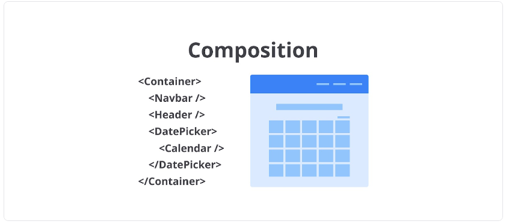

Semakin kecil kita membuat sebuah component, semakin reusable UI yang kita bangun dan React mendorong kita untuk membangun aplikasi dengan pendekatan composition daripada inheritance untuk menghasilkan UI yang lebih kompleks [6]. 

Mari kita ambil contoh UI di bawah ini.

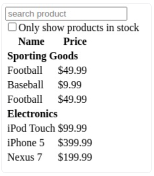

Oke. Menurut Anda bagaimana cara terbaik untuk membangun UI tersebut? Apakah dengan membuat satu component besar bernama FilterableProductTable seperti berikut?

```
function FilterableProductTable() {
  return (
    <div className="container">
      <div className="search-bar__container">
        <input type="text" placeholder="Search..." />
        <div className="search-bar__in_stock_checkbox">
          <input type="checkbox" />
          <label>Only show products in stock</label>
        </div>
      </div>
      <div className="product-table__container">
        <table>
          <tr>
            <th>Name</th>
            <th>Price</th>
          </tr>
          <tr>
            <td colSpan="2">
              <strong>Sporting Goods</strong>
            </td>
          </tr>
          <tr>
            <td>Football</td>
            <td>$49.99</td>
          </tr>
          <tr>
            <td>Baseball</td>
            <td>$9.99</td>
          </tr>
          <tr>
            <td>Basketball</td>
            <td>$29.99</td>
          </tr>
          <tr>
            <td colSpan="2">
              <strong>Electronics</strong>
            </td>
          </tr>
          <tr>
            <td>iPod Touch</td>
            <td>$99.99</td>
          </tr>
          <tr>
            <td>iPhone 5</td>
            <td>$399.99</td>
          </tr>
          <tr>
            <td>Nexus 7</td>
            <td>$199.99</td>
          </tr>
        </table>
      </div>
    </div>
  );
}
```

Tentu tidak ya! Jika Anda menghadapi kasus seperti ini, pecahlah component besar menjadi beberapa component yang lebih kecil. Mungkin Anda bertanya-tanya, bagaimana caranya kita mengetahui kapan harus membuat component secara terpisah?

Jawabannya adalah gunakan intuisi Anda untuk memutuskan apakah membutuhkan fungsi baru atau tidak. Namun, jangan lupa selalu benamkan dalam pemikiran Anda bahwa setiap fungsi haruslah memiliki satu tanggung jawab saja (single-responsibility principle). Nah, component pun sama. Idealnya, ia hanya melakukan satu hal saja. Jika memang component haruslah kompleks, ia akan memiliki beberapa component kecil lainnya.

Agar lebih mudah lagi dalam menentukannya, sketsakan pemecahan UI-nya seperti ini.

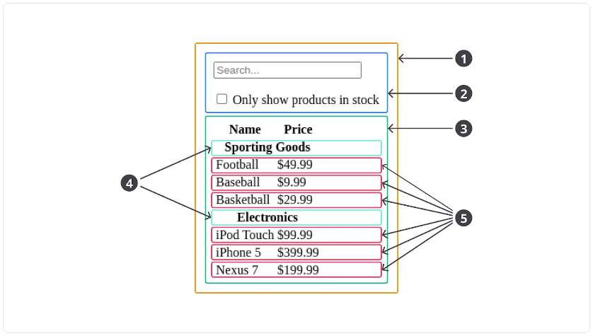

Sketsa di atas menunjukkan UI dapat dipecah menjadi 5 bagian component. Berikut nama dan tugas dari component tersebut.

1. FilterableProductTable (kuning): Sebagai container atau penampung seluruh UI yang perlu ditampilkan.
2. SearchBar (biru): Menerima input dari pengguna.
3. ProductTable (hijau): Sebagai tabel yang menampilkan data hasil dari input pengguna.
4. ProductCategoryRow (biru muda): Menampilkan heading untuk setiap kategori produk.
5. ProductRow (merah): Menampilkan item produk.

**Catatan:** Jika Anda perhatikan pada component ProductTable, terdapat header--bertuliskan name dan price--yang tidak kami jadikan sebagai component tersendiri. Hal ini sebenarnya preferensi masing-masing apakah mau dibuatkan component terpisah atau tidak. Kami tidak memisahkan heading karena ia hanyalah teks statis dan masih bagian dari tanggung jawab ProductTable dalam menampilkan tabel. Namun, jika Anda ingin menambahkan fungsi sorting pada heading tersebut, pecahlah heading menjadi ProductTableHeader component.

Setelah mengidentifikasi pemecahan component, mari kita refactor kode dalam membuat FilterableProductTable component menjadi seperti ini.


```
function SearchBar() {
  return (
    <div className="search-bar__container">
      <input type="text" placeholder="Search..." />
      <div className="search-bar__in_stock_checkbox">
        <input type="checkbox" />
        <label>Only show products in stock</label>
      </div>
    </div>
  );
}
 
function ProductCategoryRow({ name }) {
  return (
    <tr>
      <td colSpan="2">
        <strong>{name}</strong>
      </td>
    </tr>
  );
}
 
function ProductRow({ name, price }) {
  return (
    <tr>
      <td>{name}</td>
      <td>{price}</td>
    </tr>
  );
}
 
function ProductTable() {
  return (
    <div className="product-table__container">
      <table>
        <tr>
          <th>Name</th>
          <th>Price</th>
        </tr>
        <ProductCategoryRow name="Sporting Goods" />
        <ProductRow name="Football" price="$49.99" />
        <ProductRow name="Baseball" price="$9.99" />
        <ProductRow name="Baseketball" price="$49.99" />
        <ProductCategoryRow name="Electronics" />
        <ProductRow name="iPod Touch" price="$99.99" />
        <ProductRow name="iPhone 5" price="$399.99" />
        <ProductRow name="Nexus 7" price="$199.99" />
      </table>
    </div>
  );
}
 
function FilterableProductTable() {
  return (
    <div className="container">
      <SearchBar />
      <ProductTable />
    </div>
  );
}
```
Berikut adalah hirarki dari component di atas.

- FilterableProductTable
    - SearchBar
    - ProductTable
        - ProductCategoryRow
        - ProductRow


# Latihan Membuat dan Komposisi React Component
Setelah memahami materi yang diberikan tentang React component, kini saatnya kita latihan untuk membuat UI yang reusable memanfaatkan React Component. Berikut tujuan dari latihan kali ini.

- Membuat React component menggunakan fungsi JavaScript.
- Membuat React component menjadi reusable dengan memanfaatkan props.
- Komposisi React component guna membangun component yang kompleks.

Agar latihannya terasa segar, kita akan membuat UI yang berbeda dari latihan sebelumnya. Saat ini kami mengambil tema “berita”, alias website yang menampilkan daftar berita sederhana.


Sudah siap? Yuk kita mulai latihannya.

Silakan buka kembali dicoding-react-starter karena kita akan menuliskan kode di sana.

1. Sebelum mulai menuliskan kode, ada baiknya kita telaah dulu UI yang akan dibuat. 
2. Buatlah sketsa agar mudah dalam memecah component yang akan dibuat.

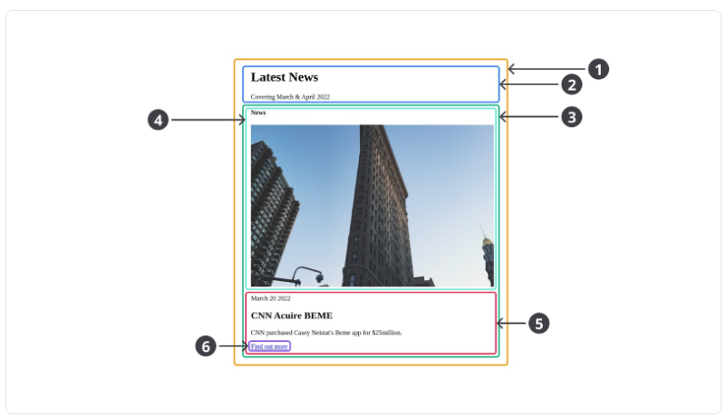


**Ada 6 component yang akan kita buat dalam menyusun UI tersebut. Berikut penjelasan masing-masing component-nya:**

**News (1) :** Component yang bertanggung jawab sebagai parent untuk menampung seluruh UI yang ditampilkan.
**Header (2) :** Component yang bertanggung jawab sebagai UI header dari News.
**Card (3) :** Component yang bertanggung jawab sebagai parent untuk menampung card (item) dari berita. Component ini nantinya akan digunakan kembali untuk menampilkan item berita dengan data yang berbeda.
**CardHeader (4) :** Component yang bertanggung jawab menampilkan bagian header dari item berita.
**CardBody (5) :** Component yang bertanggung jawab menampilkan bagian body dari item berita.
**Button (6) :** Component yang bertanggung jawab untuk menampilkan tautan ke berita (dumi).


3. Lanjut! Sketsa di atas menunjukkan bahwa kita perlu membuat 6 component. Agar proses pembuatan masing-masing component-nya terasa mudah, buatlah placeholder dari setiap component-nya terlebih dahulu dengan kode berikut.

```
import React from 'react';
import { createRoot } from 'react-dom/client';
 
function Button() {
  // TODO: selesaikan component-nya
}
 
function CardHeader() {
  // TODO: selesaikan component-nya
}
 
function CardBody() {
  // TODO: selesaikan component-nya
}
 
function Card() {
  // TODO: selesaikan component-nya
}
 
function Header() {
  // TODO: selesaikan component-nya
}
 
function News() {
  // data news
  const someNews = [
    {
      title: 'CNN Acuire BEME',
      date: 'March 20 2022',
      content: "CNN purchased Casey Neistat's Beme app for $25million.",
      image: 'https://source.unsplash.com/user/erondu/600x400',
      category: 'News',
      link: '#'
    },
    {
      title: 'React and the WP-API',
      date: 'March 19 2022',
      content: 'The first ever decoupled starter theme for React & the WP-API.',
      image: 'https://source.unsplash.com/user/ilyapavlov/600x400',
      category: 'News',
      link: '#'
    },
    {
      title: 'Nomad Lifestyle',
      date: 'March 19 2022',
      content: 'Learn our tips and tricks on living a nomadic lifestyle.',
      image: 'https://source.unsplash.com/user/erondu/600x400',
      category: 'Travel',
      link: '#'
    }
  ];
 
  // TODO: selesaikan component-nya
  return <div>Selesaikan componentnya</div>;
}
 
const root = createRoot(document.getElementById('root'));
root.render(<News />);
```

Masih ingatkah Anda dengan materi Unidirectional Data Flow di modul Konsep Dasar React? Di sana kami menyebutkan bahwa data hanya disimpan pada induk component. Jika child component butuh mengakses datanya, data akan dikirim dari parent component melalui properti.

Oleh karena itu, kami menyimpan data someNews di dalam component News. Alasannya karena component tersebut bertugas sebagai parent untuk menampung seluruh UI yang akan ditampilkan pada Browser.
Semoga kalian paham maksudnya, ya. Jika belum, jangan sungkan untuk membuka pertanyaan di forum diskusi.

Simpan perubahan kode di atas dan tampilan browser CodeSandBox akan tampak seperti berikut.

Setelah menyiapkan placeholder, selanjutnya kita akan selesaikan component-nya satu per satu.

4. Agar mudah, kita akan mulai membuat component yang paling sederhana dulu. Indikasinya adalah component tersebut tidak nested alias tidak membutuhkan component lain di dalamnya. Contohnya adalah component **Button**.

Yuk kita selesaikan componentnya dengan menulis kode seperti ini pada fungsi Button.

```
function Button({ link }) {
  return <a href={link}>Find out more</a>;
}
```

Component Button menerima satu properti yaitu link yang merupakan alamat dari berita yang ditampilkan. Nilai dari properti link nantinya akan diberikan oleh induk component-nya yaitu CardBody (ingat konsep unidirectional data flow!).

Oke, component Button sudah selesai dibuat. Mudah ‘kan? Kita bisa lanjut ke component lain.

5. Sekarang kita selesaikan component CardHeader. Silakan tuliskan kode berikut.

```
function CardHeader({ image, category }) {
  return (
    <header>
      <h4>{category}</h4>
      
    </header>
  );
}
```

Jika dilihat pada sketsa, CardHeader bertugas untuk menampilkan bagian header dari item berita (Card). Di sana terdapat informasi kategori dan gambar dari berita. Itulah mengapa CardHeader yang kita buat menerima dua properti yaitu image dan category. Paham ‘kan?

Jika sudah paham, yuk beralih ke component lainnya.

6. Selanjutnya kita selesaikan component CardBody dengan menulis kode berikut.

```
function CardBody({ date, title, content, link }) {
  return (
    <div>
      <p>{date}</p>
      <h2>{title}</h2>
      <p>{content}</p>
      <Button link={link} />
    </div>
  );
}
```

Berkaca pada sketsa yang ada, CardBody bertugas untuk menampilkan informasi tanggal, judul, dan konten berita. Itulah mengapa component ini memiliki properti date, title, dan content.

Hal menarik dari component ini adalah kita komposisikan dengan penggunaan component Button (yang sebelumnya sudah dibuat). Karena penggunaan component Button membutuhkan nilai link, tentu CardBody perlu menyediakannya (yang akan diberikan oleh induk CardBody melalui properti).

7. Component selanjutnya yang akan kita selesaikan adalah Card. Silakan tulis kode berikut.

```
function Card({ image, category, date, title, content, link }) {
  return (
    <article>
      <CardHeader image={image} category={category} />
      <CardBody date={date} title={title} content={content} link={link} />
    </article>
  );
}
```

Di component ini, kita komposisikan penggunaan component CardHeader dan CardBody yang sebelumnya sudah dibuat. Karena component Card menggunakan kedua komponen tersebut, ia harus menyediakan seluruh data yang dibutuhkan melalui properti.

8. Lanjut ke component Header. Silakan tuliskan kode berikut.

```
function Header({ title, subtitle }) {
  return (
    <header>
      <h1>{title}</h1>
      <p>{subtitle}</p>
    </header>
  );
}
```

Di sketsa, component header ini menampilkan 2 informasi, yakni judul dan subjudul. Jadi, kita sediakan 2 properti bernama title dan subtitle.

Sebetulnya, eksistensi component Header ini bersifat preferensi. Tak salah bila Anda menganggap komponen ini tidak perlu dibuat terpisah dan bisa langsung menuliskan element pada component News. Namun, bila Anda ingin Header ini bersifat reusable, tidak ada salahnya untuk menjadikannya component terpisah.

9. Terakhir, kita selesaikan pembuatan component News. Di component ini, sebenarnya kita hanya tinggal menggunakan komponen yang sudah dibuat sebelumnya dan memberikan data melalui properti agar dapat tampil pada Browser.

Silakan tuliskan kode berikut.

```
function News() {
  // data news
  const someNews = [
    {
      title: 'CNN Acuire BEME',
      date: 'March 20 2022',
      content: "CNN purchased Casey Neistat's Beme app for $25million.",
      image: 'https://source.unsplash.com/user/erondu/600x400',
      category: 'News',
      link: '#'
    },
    {
      title: 'React and the WP-API',
      date: 'March 19 2022',
      content: 'The first ever decoupled starter theme for React & the WP-API.',
      image: 'https://source.unsplash.com/user/ilyapavlov/600x400',
      category: 'News',
      link: '#'
    },
    {
      title: 'Nomad Lifestyle',
      date: 'March 19 2022',
      content: 'Learn our tips and tricks on living a nomadic lifestyle.',
      image: 'https://source.unsplash.com/user/erondu/600x400',
      category: 'Travel',
      link: '#'
    }
  ];
 
  // TODO: selesaikan component-nya
  return (
    <div>
      <Header title="Latest News" subtitle="Covering March & April 2022" />
      <Card 
        title={someNews[0].title}
        date={someNews[0].date}
        content={someNews[0].content}
        image={someNews[0].image}
        category={someNews[0].category}
        link={someNews[0].link}
      />
      <Card 
        title={someNews[1].title}
        date={someNews[1].date}
        content={someNews[1].content}
        image={someNews[1].image}
        category={someNews[1].category}
        link={someNews[1].link}
      />
      <Card 
        title={someNews[2].title}
        date={someNews[2].date}
        content={someNews[2].content}
        image={someNews[2].image}
        category={someNews[2].category}
        link={someNews[2].link}
      />
    </div>
  );
}
```

Simpan kode tersebut dan kini Browser akan menampilkan data someNews.


Berhasil ‘kan? Lihat betapa reusable-nya component Card yang kita buat. Cukup dengan membuat satu component, kita dapat menampilkan daftar berita dengan data yang berbeda-beda. Component merupakan salah satu fitur yang membuat React sangat powerful.

Kode dalam menetapkan properti pada component Card sebetulnya bisa kita tuliskan dengan cara yang lebih baik lagi. Karena nama dari properti objek news (item dari someNews) identik dengan nama properti yang dibutuhkan oleh component Card, pemberian nilai propertinya dapat dipersingkat menggunakan spread operator seperti ini.

```
<Card {...someNews[0]} />
<Card {...someNews[1]} />
<Card {...someNews[2]} />
```

Sehingga, Anda tidak perlu repot menuliskan dan memetakkan nilai properti secara manual. Namun, teknik ini hanya dapat dilakukan bila nama properti dari objek yang di-spread sama dengan nama properti pada component.

***Catatan: Jangan tutup dulu proyek latihan kali ini, karena kita akan melanjutkan latihan pada materi berikutnya. Di latihan selanjutnya, kita akan memperbaiki cara kita membuat daftar berita untuk meminimalisir kode yang repetitif.***


# Latihan Membuat List UI

Di latihan sebelumnya, Anda sudah berhasil menampilkan UI dengan memanfaatkan component. Anda juga sudah berhasil mempraktikkan teknik composition dalam membuat component yang kompleks. Dengan component dan teknik composition, membuat UI yang dibangun React menjadi sangat reusable dan powerful.

Di latihan kali ini, Anda akan belajar bagaimana cara menampilkan UI dalam bentuk list (daftar) menggunakan React. Tujuan utama kita adalah mengubah penggunaan component Card yang dilakukan secara manual dan repetitif agar penulisannya lebih efektif.

```
<Card {...someNews[0]} />
<Card {...someNews[1]} />
<Card {...someNews[2]} />
```

Namun, sebelum itu, ada penjelasan singkat yang ingin kami bahas mengenai pembuatan list di React.

### Penjelasan Singkat Mengenai List di React
Dalam membangun aplikasi, list merupakan hal yang fundamental. Kami yakin hampir setiap aplikasi yang pernah Anda buat, terdapat data yang perlu ditampilkan dalam bentuk list.

Beberapa Framework JavaScript (selain React) memiliki API (cara) khusus dalam menampilkan list, contohnya Vue dan Angular.

vuejs

```
<ul id="news">
  <li v-for="news in someNews">{{ news.title }}</li>
</ul>
```

angular

```
<ul id="news">
  <li *ngFor="let news of someNews">{{ news.title }}</li>
</ul>
```

Lain halnya dengan React yang mengambil pendekatan yang berbeda. Sebisa mungkin, React tetap mencoba tingkatan API yang dimilikinya seminimal mungkin. Kebanyakan React mengandalkan fitur yang sebenarnya sudah dimiliki JavaScript secara standar. Termasuk teknik dalam menampilkan list.

Jika melihat kembali contoh kode Vue dan Angular, tujuan utamanya adalah me-render list item (li) sebanyak item yang berada di array someNews. Apakah Anda tahu bahwa tujuan tersebut sebenarnya mampu dilakukan hanya menggunakan JavaScript standar? Alih-alih membuat API baru untuk menampilkan list di React, kita bisa manfaatkan fungsi array map seperti ini.

```
<ul id="news">
  { someNews.map((news) => <li>{news.title}</li>) }
</ul>
```

Sangat jelas ‘kan? Tidak ada API baru yang perlu Anda ingat dan pelajari. Jika Anda mengetahui cara penggunaan map, Anda akan langsung mengerti bagaimana cara membuat list di React.

Jika sudah paham kita mulai latihannya.

1. Pastikan Anda masih membuka proyek latihan sebelumnya. Jika sudah tertutup, silakan ulang kembali to-do yang ada di materi sebelumnya.

2. Fokus pada kode yang berada di dalam component News, silakan ubah penggunaan component Card yang repetitif menjadi seperti ini (lihat kode pada map).


```
function News() {
  // data news
  const someNews = [
    {
      title: 'CNN Acuire BEME',
      date: 'March 20 2022',
      content: "CNN purchased Casey Neistat's Beme app for $25million.",
      image: 'https://source.unsplash.com/user/erondu/600x400',
      category: 'News',
      link: '#'
    },
    {
      title: 'React and the WP-API',
      date: 'March 19 2022',
      content: 'The first ever decoupled starter theme for React & the WP-API.',
      image: 'https://source.unsplash.com/user/ilyapavlov/600x400',
      category: 'News',
      link: '#'
    },
    {
      title: 'Nomad Lifestyle',
      date: 'March 19 2022',
      content: 'Learn our tips and tricks on living a nomadic lifestyle.',
      image: 'https://source.unsplash.com/user/erondu/600x400',
      category: 'Travel',
      link: '#'
    }
  ];

  return (
    <div>
      <Header title="Latest News" subtitle="Covering March & April 2022" />
      {someNews.map((news) => (
        <Card {...news} />
      ))}
    </div>
  );
}
```

Simpan perubahannya dan pastikan UI yang sama masih tampak pada Browser.

Kini kita tidak perlu lagi menggunakan component Card secara manual sebanyak item dari array. Dengan menggunakan map, kita dapat melakukannya secara otomatis. Keren ‘kan?

3. Sayangnya, dalam menampilkan list di React tak hanya sampai di sini. Coba Anda lihat console browser pada CodeSandbox, pasti ada pesan eror yang muncul seperti ini.

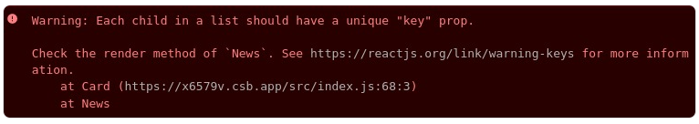

Ada sedikit hal yang perlu kita tambahkan ketika me-render React element atau component sebagai list, yaitu properti key pada tiap item element/component yang hendak ditampilkan. Tujuannya adalah sebagai tanda bahwa masing-masing element/component yang ditampilkan adalah unik.

Agar nilai key ini unik, kita beri saja judul dari berita ```(news.title)```. Silakan tambahkan kode berikut pada penggunaan component Card.

```
<Card {...news} key={news.title} />
```

Pastikan eror tersebut sudah tidak muncul lagi (lakukan clear console terlebih dulu dan reload browser-nya).

***Mengapa React membutuhkan properti key dalam me-render list? Alasannya adalah performa. Dengan memberikan nilai unik melalui properti key, React dapat mengetahui item mana yang berubah ketika terjadi perubahan data dan me-render ulang component yang datanya berubah saja. Hal ini sangat memengaruhi performa bila menampilkan banyak daftar item.***


---------------------------------------------------------------------------------------
# React Project
Sebelumnya, Anda banyak menuliskan kode React pada platform CodeSandBox. That works! Namun, platform tersebut cocok bila Anda ingin bermain atau mencoba potongan-potongan kode React karena Anda tidak perlu repot untuk menyiapkan proyek secara lokal. Untuk membuat proyek yang kompleks, sebaiknya buatlah proyek React lokal secara mandiri.

Untuk membuat proyek secara lokal sebenarnya terdapat 2 cara, yaitu cara mudah dan sulit. Masing-masing cara sebenarnya memiliki kelebihannya sendiri. Ketika kami memberikan cara yang sulit, Anda akan lebih memahami secara lebih rinci kebutuhan dalam menjalankan kode React. Namun, prosesnya akan panjang dan cukup untuk membuat kepala pusing.

Melihat ini adalah kelas pemula, kami tak ingin materi yang rumit disampaikan di kelas ini. Lebih baik Anda fokus pada “cara membuat aplikasi dengan React”, bukan mengetahui “bagaimana module bundler dan Babel bekerja”. Oleh karena itu, kami akan mengambil pendekatan yang lebih mudah.

Di materi awal kelas, kami menyinggung tentang React Ecosystem (kami harap Anda masih mengingatnya). Ada React Ecosystem yang dapat memudahkan Anda dalam menyiapkan proyek React di lokal, yakni Vite.

Kita sangat beruntung karena Vite menawarkan Anda untuk membuat proyek React hanya dengan sekali menuliskan perintah saja. Setelah itu, di balik layar Vite akan secara otomatis menyiapkan kebutuhan untuk menjalankan proyek React. Jika kita mengambil cara yang sulit, seluruh persiapan yang otomatis perlu kita siapkan secara mandiri.

Oke agar lebih jelas, kita langsung praktik saja.

## Latihan Studi Kasus: Membuat Proyek React

Latihan kali ini bertujuan untuk membuat proyek React (contacts-app) secara lokal menggunakan create-react-app. Simak langkah-langkahnya di bawah ini.

1. Sebelum membuat proyek, pastikan lagi komputer Anda sudah terpasang Node.js dengan versi minimal 14 dan NPM dengan versi minimal 6. Untuk memastikannya, silakan tulis perintah berikut satu per satu pada CMD atau Terminal.

```
node -v
npm -v
```

2. Setelah itu, saatnya kita buat proyek React baru menggunakan perintah berikut.

```
npm create vite
```

Perintah di atas akan mengarahkan npm untuk membuat proyek aplikasi web dengan menggunakan Vite. Mungkin sebagian dari Anda penasaran, apa itu perintah npm create?

npm create sebenarnya adalah sinonim (alias) dari perintah npm init yang berarti menginisialisasi proyek Node.js baru. Dengan menambahkan argumen vite di akhir perintahnya, itu berarti kita memanfaatkan templat yang disediakan oleh Vite.

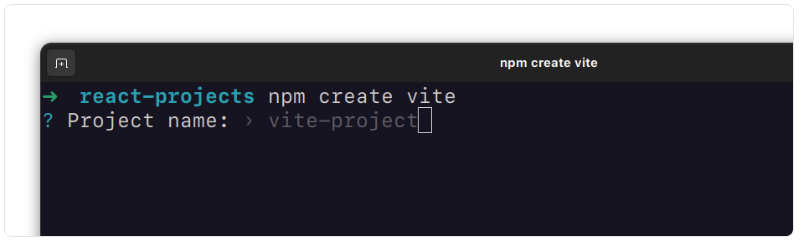

Setelah mengeksekusi perintah di atas, proses pembuatan proyek dengan Vite akan dimulai. Anda akan diberi beberapa pertanyaan terkait informasi proyek yang hendak dibuat, seperti nama proyek, pemilihan library/framework, dan bahasa pemrograman yang digunakan.

Agar mudah dalam mengikuti materi kami ke depannya, jawablah pertanyaan dengan jawaban berikut ini.

- Project name -> **contacts-app**
- Select a framework -> **React**
- Select a variant -> **JavaScript**

3. Setelah itu, pada target folder yang Anda kehendaki, seharusnya sudah ada folder proyek React bernama contacts-app.

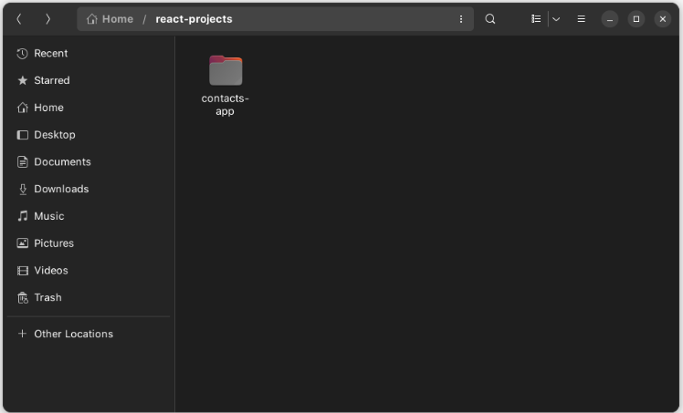

4. Buka Terminal VSCode dan jalankan perintah ```npm install``` untuk memasang seluruh package yang dibutuhkan di dalam berkas package.json.


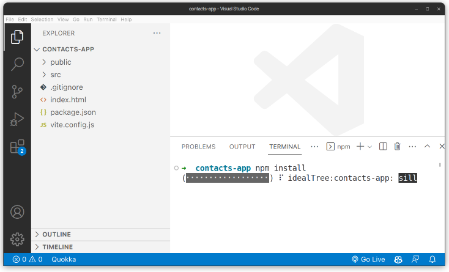


5. Oke! Proyek contacts-app berhasil dibuat dan Vite sudah menyediakan beberapa berkas sebagai template yang dapat Anda manfaatkan di sana. Sekarang coba buka folder src dan public, di dalamnya ada banyak file yang sudah tersedia.

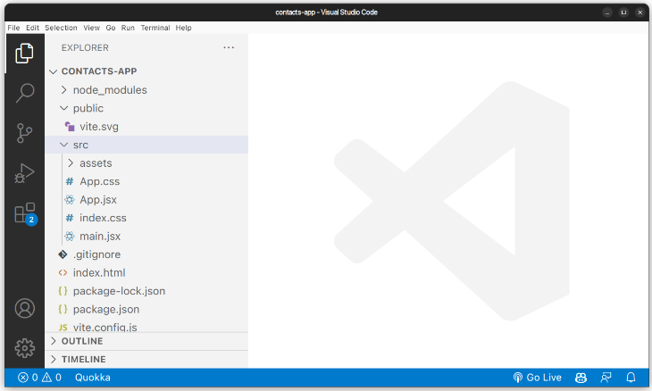


Jangan pusing ketika Anda melihat berkas-berkas yang ada di sana karena nantinya kita akan membuat berkas di dalam folder src dari nol, ya!

***Di proyek yang dibangun dengan Vite, folder src digunakan untuk menampung source code JavaScript (termasuk JSX) dan assets yang diimpor langsung pada JavaScript.***

Sedangkan folder public digunakan untuk menampung assets yang ingin diakses melalui public URL aplikasi. Selama fase pengembangan, biasanya URL beralamat di localhost.

6. Sekarang, coba buka berkas package.json. Di sana Anda bisa melihat runner scripts untuk menjalankan proyek dan mem-build proyek.

Untuk menjalankannya, cukup tuliskan perintah berikut pada Terminal proyek.

```
npm run dev
```

Kemudian Vite akan menjalankan aplikasi web (React) di alamat http://localhost:5173/. Anda bisa akses alamat tersebut untuk membuka aplikasi.

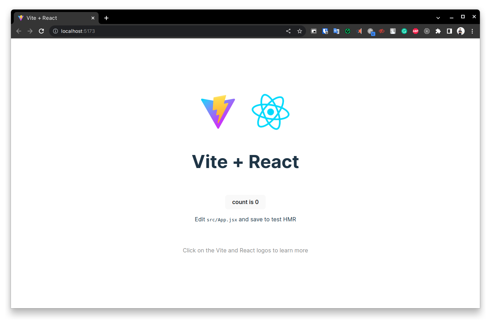

7. Secara default, tampilan aplikasi yang dibangun menggunakan Vite akan menampilkan component App. Component tersebut berlokasi di src/App.jsx. Anda bisa mengubah konten yang ditampilkan pada component tersebut dan seketika Browser akan me-reload secara otomatis untuk menampilkan konten terbaru.

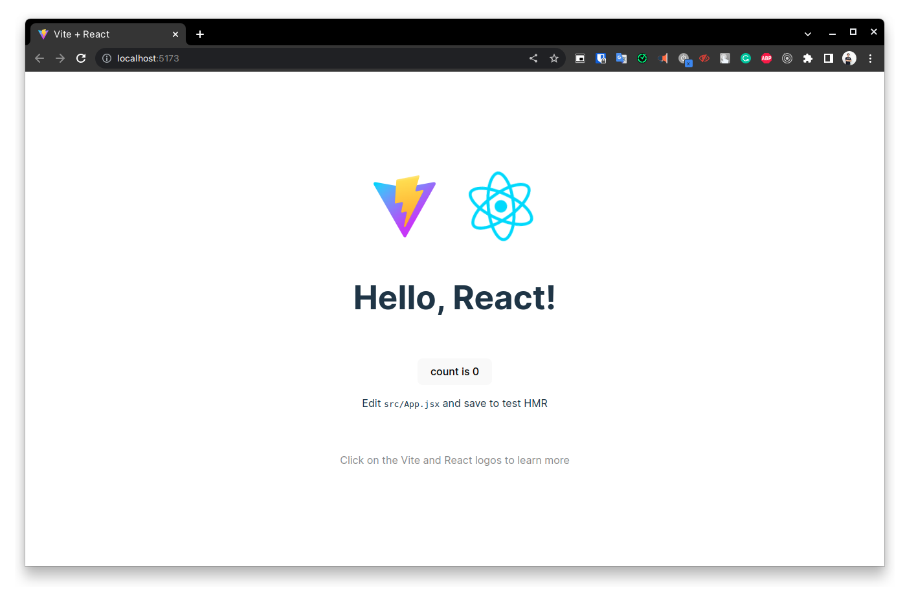

8. Satu hal yang perlu Anda ketahui ketika membuat proyek web dengan Vite, yakni berkas index.html merupakan entry point dari aplikasi. Jadi, pastikan untuk tidak menghapus berkas index.html yang berada di folder proyek. Jika Anda ingin tahu lebih detail mengenai ini, kunjungi dokumentasi Vite tentang index.html dan Project Root buka tautan:

https://vitejs.dev/guide/#index-html-and-project-root

9. Selain menjalankan proyek, Anda juga bisa mem-build proyek ke dalam berkas HTML, CSS, dan JS secara statis. Hal ini wajib Anda lakukan ketika hendak men-deploy website ke tahap production.

***Untuk build proyek React, Anda bisa gunakan perintah berikut.***

```
npm run build
```

Kemudian, akan tercipta folder baru bernama “dist” yang di dalamnya terdapat berkas HTML, CSS, JS, dan berkas lain (seluruh berkas yang berada di folder public) yang dibutuhkan oleh aplikasi agar dapat berjalan dengan baik.

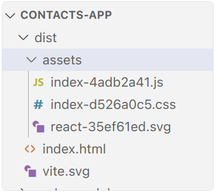

10. Sebelum kita mulai menyiapkan berkas-berkas sesuai dengan proyek hendak dibuat, inilah waktu yang tepat jika Anda ingin bereksplorasi terlebih dulu dengan proyek yang disediakan Vite secara default. Jika Anda sudah paham struktur proyeknya, yuk kita melangkah ke tahap selanjutnya.

11. Untuk meminimalisir distraksi oleh berkas-berkas yang sebenarnya belum kita butuhkan, kami sangat menyarankan Anda untuk **menghapus seluruh berkas yang ada di dalam folder src**. Kita akan membuat berkas yang dibutuhkan satu per satu sehingga lebih mudah untuk memahaminya karena sebenarnya hanya segelintir berkas saja yang kita butuhkan saat ini.

Silakan kosongkan folder src. Anda juga bisa menghapus folder dist (karena belum dibutuhkan) seperti gambar di bawah ini.

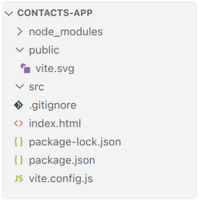

12. Kita mulai dengan membuat berkas JavaScript bernama index.jsx di dalam folder src.

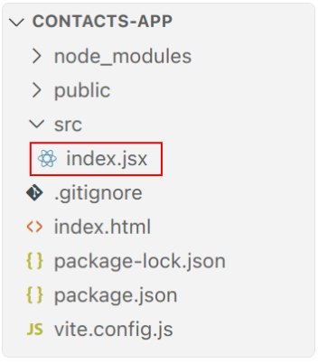

13. Di dalamnya, kita tuliskan saja kode “Hello, World” dari penggunaan React sebagai placeholder. Seharusnya Anda sudah paham ‘kan seperti apa?

```
import React from 'react';
import { createRoot } from 'react-dom/client';
 
const element = <h1>Hello, world!</h1>;
 
const root = createRoot(document.getElementById('root'));
root.render(element);
```

Sebab kita menggunakan nama berkas JavaScript yang berbeda dari yang disediakan oleh Vite sebelumnya, kita perlu mengubah nama berkas JavaScript yang digunakan pada index.html dari main.jsx menjadi index.jsx.

Bukalah berkas index.html dan ubah kode yang dicoret seperti ini.

```
<!DOCTYPE html>
<html lang="en">
 <head>
   <meta charset="UTF-8" />
   <link rel="icon" type="image/svg+xml" href="/vite.svg" />
   <meta name="viewport" content="width=device-width, initial-scale=1.0" />
   <title>Vite + React</title>
 </head>
 <body>
   <div id="root"></div>
   <!-- <script type="module" src="/src/main.jsx"></script> -->
   <script type="module" src="/src/index.jsx"></script>
 </body>
</html>
```

14. Simpan seluruh perubahan dan jalankan kembali proyek React dengan perintah npm run dev. Kini Browser akan menampilkan UI seperti ini.

Dengan menghapus berkas template yang belum dibutuhkan, semoga Anda menjadi lebih paham fungsi-fungsi berkas yang ada di dalam proyek contacts-app.
Kita akan mulai mengerjakan contact-app pada materi selanjutnya. Jika Anda merasa lelah, silakan istirahat dulu. Jika sudah siap, yuk kita lanjut ke latihan selanjutnya!

## Latihan Studi Kasus: Menampilkan Daftar Kontak
Pada latihan sebelumnya, Anda sudah berhasil membuat proyek React (contacts-app) secara lokal. Sekarang, kita akan melanjutkan pembuatan aplikasi daftar kontak sesuai rencana awal. Latihan ini bertujuan untuk meningkatkan “jam terbang” Anda dalam menggunakan React.

Kita akan membangun aplikasi secara bertahap. Di akhir dari modul ini setidaknya Anda akan berhasil menampilkan daftar kontak sederhana seperti ini.

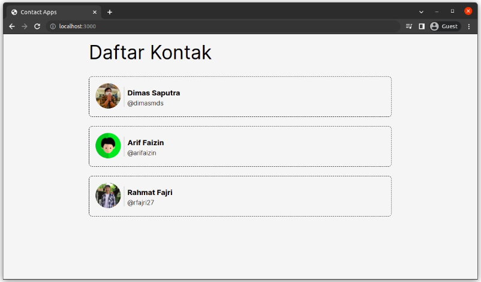

Mengingat Anda sudah banyak berlatihan di materi sebelumnya, seharusnya latihan kali ini akan mudah. Jadi, mari kita mulai!


1. Pertama, silakan unduh dulu beberapa aset gambar yang diperlukan pada aplikasi di tautan berikut: https://github.com/dicodingacademy/a403-react-pemula-labs/raw/099-shared-files/01-materials/images.zip

2. Selanjutnya pada proyek contacts-app, buat folder baru bernama images di dalam folder public.

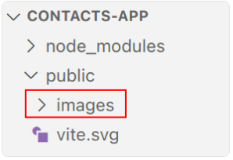

3. Kemudian, ekstrak berkas ZIP yang telah diunduh pada langkah pertama. Setelah itu, simpan seluruh gambar di dalam folder public - images.

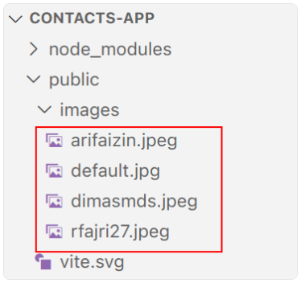

Seperti biasa, sebelum kita mulai menulis kode ada baiknya buatlah sketsa untuk menentukan pemecahan component yang akan dibuat.

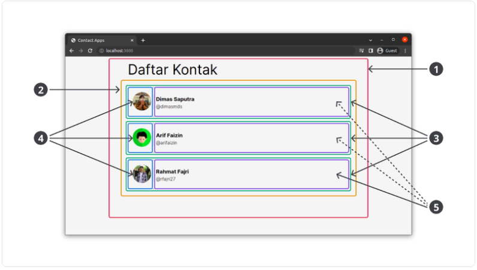

Berikut adalah pemecahan dari component-nya.

1. ContactApp (merah) : Sebagai parent yang menampung seluruh UI yang ditampilkan, termasuk lokasi di mana data contacts berada.

2. ContactList (kuning) : Sebagai container dalam membuat list contact.

3. ContactItem (hijau) : Sebagai container dalam menampilkan item contact.

4. ContactItemImage (biru) : Menampilkan gambar contact.

5. ContactItemBody (ungu) : Menampilkan data nama dan tag sosial media dari kontak.

Sebelum membuat component satu per satu, siapkan dulu data yang hendak ditampilkan pada berkas JavaScript terpisah. Buatlah berkas JavaScript baru bernama data.js dan tuliskan kode berikut.

```
const getData = () => {
 return [
   {
     id: 1,
     name: 'Dimas Saputra',
     tag: 'dimasmds',
     imageUrl: '/images/dimasmds.jpeg',
   },
   {
     id: 2,
     name: 'Arif Faizin',
     tag: 'arifaizin',
     imageUrl: '/images/arifaizin.jpeg',
   },
   {
     id: 3,
     name: 'Rahmat Fajri',
     tag: 'rfajri27',
     imageUrl: '/images/rfajri27.jpeg',
   },
 ];
}
 
export { getData };
```

Proyek kali ini kita akan menerapkan teknik modularisasi. Tujuannya tidak lain untuk memudahkan kita dalam mengelola kode JavaScript. Dengan memisahkan kode ke berkas yang berbeda, diharapkan tak ada lagi kode JavaScript yang panjang dalam satu berkas. Percayalah, teknik modularisasi sangat memudahkan Anda ke depannya.

Tak hanya data, teknik modularisasi juga akan diterapkan dalam pembuatan component. Jadi, setiap satu component kita tulis dalam satu berkas JavaScript terpisah.

4. Kita mulai dengan component yang paling sederhana dulu, yakni **ContactItemBody** dan **ContactItemImage**. Mengapa? Karena kedua component tersebut tidak membutuhkan component lain yang harus dibuat terlebih dulu.
Mari kita mulai dari ContactItemBody. Silakan buat berkas JavaScript baru bernama ContactItemBody.jsx di dalam folder src.

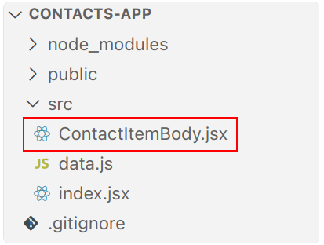

Kemudian tuliskan kode pembuatan component-nya. Jangan lupa! Karena data nama dan tag kontak akan dikirim melalui properti, pastikan Anda sudah menyiapkannya.

```
import React from 'react';
 
function ContactItemBody({ name, tag }) {
 return (
   <div className="contact-item__body">
     <h3 className="contact-item__title">{name}</h3>
     <p className="contact-item__username">@{tag}</p>
   </div>
 );
}
 
export default ContactItemBody;
```

Kita perlu memperhatikan nilai class pada React element karena nantinya class ini akan digunakan sebagai selector ketika menerapkan styling dengan CSS. Dalam memberikan nilai class, kami mencoba mengikuti gaya konvensi BEM (Block Element Modifier). Jika Anda lihat, penamaan class yang diberikan terlihat mudah dipahami dan dibaca bukan?

https://getbem.com/naming/

Selain itu, jangan lupa untuk selalu mengekspor component menggunakan export default setiap akhir pembuatan component pada berkas JavaScript. Hal tersebut dilakukan dilakukan supaya component dapat digunakan dan dikomposisikan oleh component lain di berkas JavaScript yang berbeda.

#### Pengingat: 
***Meskipun dengan JSX kita tidak perlu menggunakan keyword React ketika menggunakannya, tetapi tetap lakukan impor module React. Hal ini untuk menghindari “kemungkinan” eror yang terjadi ketika Babel hendak mengubah kode JSX menjadi kode JavaScript biasa (terutama bila Anda menggunakan React versi < 16).***

5. Kita lanjut membuat component yang kedua yaitu ContactItemImage. Silakan buat berkas JavaScript baru bernama ContactItemImage.jsx di dalam folder src.

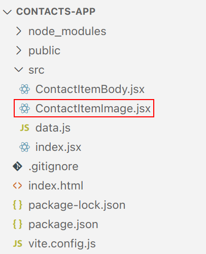

Tuliskan kode dalam membuat component-nya dan sediakan juga properti imageUrl untuk menampung url gambar yang akan diberikan oleh parent component.

Setelah komponen ContactItemBody dan ContactItemImage selesai, buatlah component ContactItem sebagai induk (parent) dari kedua komponen tersebut. Silakan buat berkas JavaScript bernama ContactItem.jsx di dalam src.

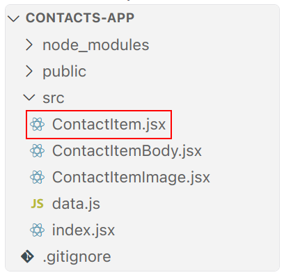

Karena komponen ContactItemBody dan ContactItemImage akan digunakan di dalam komponen ini, pastikan Anda telah menyediakan data untuk kedua komponen tersebut melalui properti.

```
import React from 'react';
import ContactItemBody from './ContactItemBody';
import ContactItemImage from './ContactItemImage';
 
function ContactItem({ imageUrl, name, tag }) {
 return (
   <div className="contact-item">
     <ContactItemImage imageUrl={imageUrl} />
     <ContactItemBody name={name} tag={tag} />
   </div>
 );
}
 
export default ContactItem;
```

6. Sekarang buatlah component ContactList. Di sinilah kita akan melakukan perulangan (menggunakan map) dalam memanggil component ContactItem sebanyak data contacts yang diberikan melalui properti.

Silakan buat berkas JavaScript ContactList.jsx di dalam folder src.


7. Komponen terakhir yang perlu kita buat adalah ```ContactApp```. Komponen ini menjadi root component atau induk dari induk component yang ada di dalam aplikasi ini. Di komponen ini juga data contacts--yang didapatkan dari fungsi getData--bersemayam.

Silakan buat berkas JavaScript bernama ContactApp.jsx di dalam src.

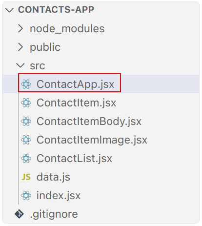

Kemudian tulis kode berikut di dalamnya.

```
import React from 'react';
import ContactList from './ContactList';
import { getData } from './data';
 
function ContactApp() {
 const contacts = getData();
 
 return (
   <div className="contact-app">
     <h1>Daftar Kontak</h1>
     <ContactList contacts={contacts} />
   </div>
 );
}
 
export default ContactApp;
```

Seperti yang Anda lihat pada kode di atas, praktik unidirectional data flow sangat kental di React. Sekali lagi, di React data selalu hidup (berada) di parent component. Jika child component membutuhkannya, data akan dikirim secara drilling (menurun) mulai dari komponen ContactList, ContactItem, ContactItemImage, dan ContactItemBody yang memanfaatkan properti.

8. Terakhir! Agar apa yang kita kerjakan dapat terlihat pada browser, render-lah component ContactApp pada root. Silakan buka berkas index.jsx dan ubah kode template “Hello, World” menjadi seperti ini.

```
import React from 'react';
import { createRoot } from 'react-dom/client';
import ContactApp from './ContactApp';
 
 
const root = createRoot(document.getElementById('root'));
root.render(<ContactApp />);
```

Simpan seluruh perubahan dan jalankan kembali proyek (jika belum berjalan). Sekarang daftar kontak sudah tampak pada Browser.

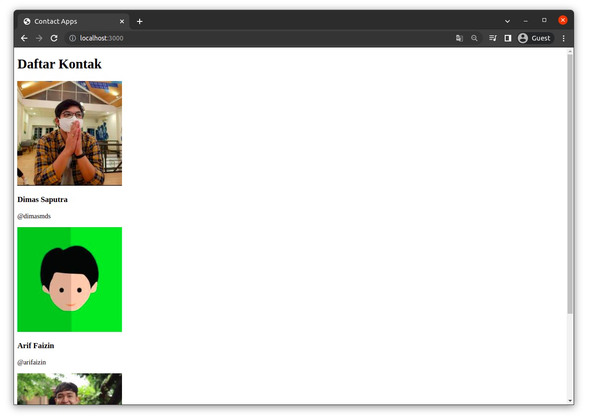

Voila! Tugas kita saat ini hampir selesai. Kita tinggal memberikan styling agar aplikasi tampak cantik. Nah, di latihan selanjutnya kami akan menunjukkan bagaimana menggunakan CSS pada proyek React.


# Latihan Studi Kasus: Memberikan Styling

Ini adalah latihan sekaligus materi terakhir yang ada di modul React UI Component. Sebelumnya, Anda sudah berhasil menampilkan daftar kontak pada proyek contacts-app, tetapi masih ada yang kurang, yaitu menerapkan styling agar aplikasi tampak lebih menarik.

Ada dua pendekatan berbeda dalam melampirkan berkas styling di proyek React. Sama seperti gambar, kita bisa memperlakukannya seperti berkas statis dengan menyimpannya di dalam folder public atau kita bisa memperlakukannya sebagai module yang diimpor di dalam kode JavaScript. Di latihan kali ini, kita akan mencoba kedua pendekatan tersebut sehingga Anda bisa mengetahui perbedaannya.

1. Kita akan coba cara pertama yaitu memperlakukan berkas CSS sebagai berkas statis. Silakan buat berkas CSS baru bernama style.css di dalam folder public.

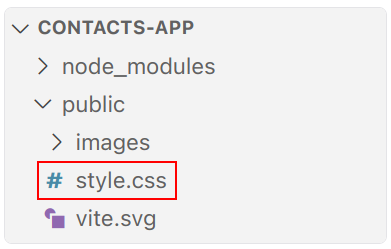

2. Kemudian tuliskan kode CSS berikut.

```
* {
    padding: 0;
    margin: 0;
    box-sizing: border-box;
}

body {
    font-family: 'Inter', sans-serif;
    background-color: whitesmoke;
}

img {
    width: 100%;
}

.contact-app {
    max-width: 800px;
    margin: 0 auto;
    padding: 16px;

}

.contact-app h1 {
    font-weight: normal;
    font-size: 48px;
    margin-bottom: 32px;
}

.contact-item {
    display: flex;
    align-items: center;
    margin: 24px 0;
    border: 1px dashed black;
    padding: 16px;
    border-radius: 8px;
}

.contact-item__image img {
    width: 64px;
    border-radius: 50%;
}

.contact-item__body {
    margin-left: 8px;
    padding-left: 8px;
    border-left: 1px solid #aaa;
    flex: 1;
}

.contact-item__title {
    padding: 4px 0;
}

.contact-item__username {
    font-weight: lighter;
}

.contact-item__delete {
    padding: 8px;
    font-size: 18px;
    background-color: orangered;
    color: white;
    border: 0;
    border-radius: 4px;
    cursor: pointer;
}

.contact-input {
    border: 1px dashed black;
    padding: 16px;
    margin: 14px 0;
    border-radius: 8px;
    margin-bottom: 32px;
}

.contact-input input {
    display: block;
    width: 100%;
    padding: 8px;
    margin: 8px 0;
    font-family: 'Inter', sans-serif;
}

.contact-input button {
    width: 100%;
    padding: 8px;
    font-family: 'Inter', sans-serif;
}
```

Kemudian buka berkas index.html dan tambahkan elemen link di dalam elemen head untuk menghubungkan berkas CSS dengan HTML.

```
   <link rel="stylesheet" href="style.css">
```

Anda juga bisa menambahkan external CSS (sebelum style.css), misalnya dari Google Font karena di proyek ini kami menggunakan font “Inter” yang tersedia di Google Font.

```
<!-- START: Google Font -->
   <link rel="preconnect" href="https://fonts.googleapis.com">
   <link rel="preconnect" href="https://fonts.gstatic.com" crossorigin>
   <link href="https://fonts.googleapis.com/css2?family=Inter:wght@300;400;700&display=swap" rel="stylesheet">
   <!-- END: Google Font -->
```

9. Simpan seluruh perubahan dan lihat kembali Browser Anda. Seharusnya aplikasi sudah berhasil menerapkan styling.

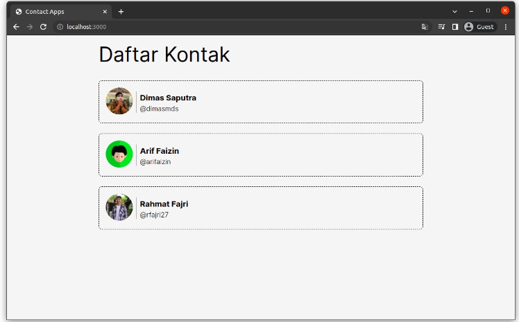

Well done! Cara pertama berhasil, mudah ‘kan?


10. ***Sekarang mari kita coba cara yang kedua yaitu memperlakukan berkas CSS sebagai module di berkas JavaScript.***

Agar dapat diimpor oleh berkas JavaScript, silakan pindahkan berkas style.css ke dalam folder src.

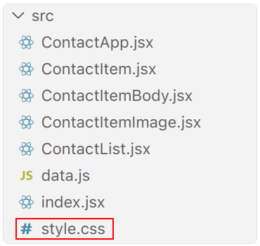

11. Kemudian hapus juga penggunaan elemen link yang menghubungkan style.css pada index.html karena sudah tidak relevan lagi (tidak berada di folder public lagi).

```
<link rel="stylesheet" href="style.css">
```

12. Coba simpan dulu seluruh perubahan dan pastikan aplikasi kembali menampilkan UI tanpa styling.

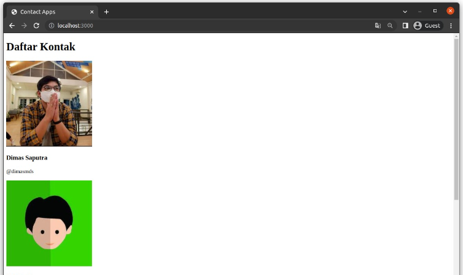

12. Kemudian, berkas index.js dan impor berkas style.css seperti ini.

```
import React from 'react';
import { createRoot } from 'react-dom/client';
import ContactApp from './ContactApp';
 
// styling
import './style.css';
 
const root = createRoot(document.getElementById('root'));
root.render(<ContactApp />);
```

Simpan perubahan kode dan lihat kembali hasilnya pada Browser. Seharusnya styling berhasil diterapkan kembali.

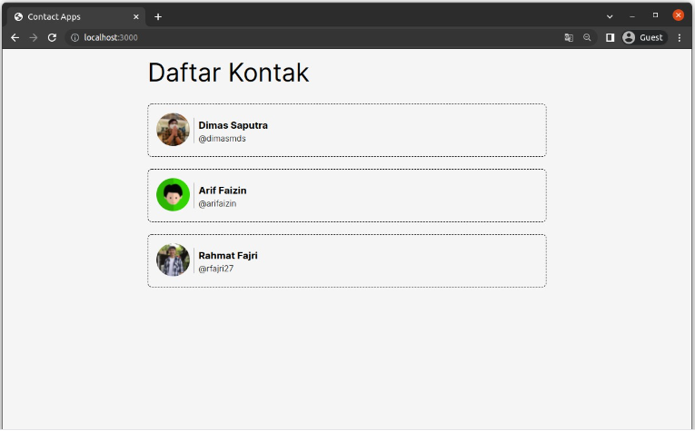

Selamat! Anda berhasil menerapkan styling dengan teknik modularisasi. Teknik ini cocok ketika Anda ingin memisahkan styling menjadi beberapa berkas css terpisah dan mengimpornya pada component yang spesifik. Dengan begitu, berkas styling dapat lebih mudah dikelola, terlebih bila proyek yang Anda buat semakin besar nantinya.


13. Karena sekarang di dalam folder src sudah mulai banyak berkas, Anda bisa mulai mengelompokkan berkas-berkas berdasarkan jenisnya. Misal, jika seluruh berkas JavaScript yang merupakan component, simpanlah di folder baru bernama components. Anda juga bisa mengelompokkan berkas CSS (walaupun saat ini hanya satu) pada folder terpisah, misalnya styles.

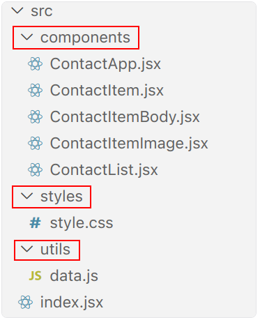

Bila sudah dikelompokkan pada folder terpisah, jangan lupa juga untuk memperbaiki beberapa path (alamat berkas) yang berubah pada saat melakukan impor di berkas index.js dan ContactApp.js.

index.jsx

```
import ContactApp from './components/ContactApp';
 
// styling
import './styles/style.css';
```


ContactApp.jsx
```
import { getData } from '../utils/data';
```

Simpan seluruh perubahan dan pastikan proyek tetap berjalan dengan baik ya!