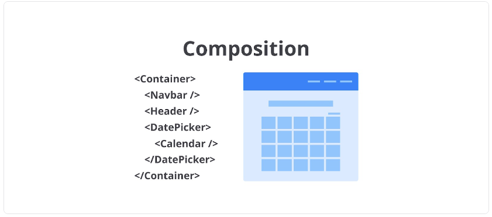
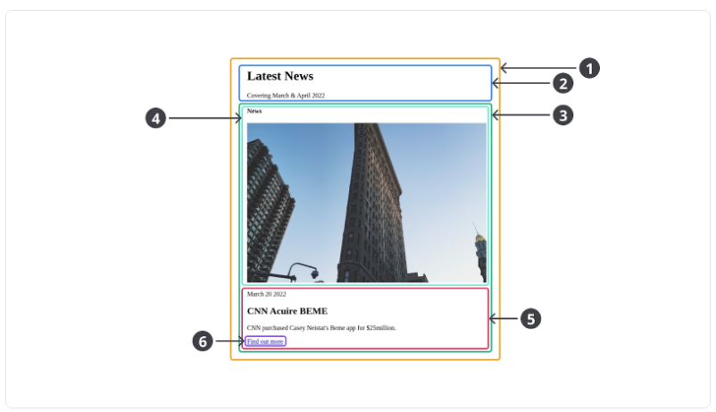

# Component Properties
Karena React component merupakan fungsi JavaScript, kita dapat memberikan parameter ketika menggunakannya. Namun, React component hanya dapat menerima satu parameter--berupa objek--yang biasa kita sebut dengan properties (props).

sayHello Component
```
function SayHello(props) {
  const name = props.name;
  const company = props.company;
 
  return (
    <p>
      Hello, {name} from {company}!
    </p>
  );
}
```

penggunaannya:
```
<SayHello name="Bill" company="Microsoft" />; // <p>Hello, Bill from Microsoft!</p>
<SayHello name="Steve" company="Apple" />; // <p>Hello, Steve from Apple!</p>
<SayHello name="Mark" company="Facebook" />; // <p>Hello, Mark from Facebook!</p>
```

Melalui props yang ditunjukkan kode di atas, kita dapat mengirimkan data ketika menggunakannya. Hal inilah yang membuat component sangat reusable karena hanya dengan satu component--beserta properti yang terdefinisikan--kita dapat menampilkan UI serupa dengan data yang berbeda.

### Beberapa Best Practice ketika membuat dan menggunakan properti

Hampir seluruh tipe data di JavaScript dapat dikirimkan melalui props. Namun, terdapat best practice dalam menetapkan properti yang penting untuk Anda ikuti. 

Best practice yang pertama adalah ***hindari penggunaan JavaScript object*** ketika mengirimkan data pada properti component.

Contohnya seperti ini:

```
function InstagramProfile(props) {
  const profile = props.profile;
  const name = profile.name;
  const username = profile.username;
  const bio = profile.bio;
  const isVerified = profile.isVerified;

  return (
    <div className="container">
      <dl>
        <dt>Name: </dt>
        <dd>{name}</dd>
        <dt>Username: </dt>
        <dd>{username}</dd>
        <dt>Bio: </dt>
        <dd>{bio}</dd>
        <dt>Verified: </dt>
        <dd>{isVerified ? 'yes' : 'no'}</dd>
      </dl>
    </div>
  );
}
 
const profile = {
  name: 'Dicoding Indonesia',
  username: 'dicoding',
  bio: 'Bangun Karirmu Sebagai Developer Profesional',
  isVerified: true
};
 
<InstagramProfile profile={profile} />; // sebisa mungkin, hindari praktik seperti ini
```

Oke, mungkin menggunakan objek sebagai “pembungkus” data terlihat lebih mudah karena kita hanya perlu mendefinisikan satu properti saja pada component yaitu profile. Namun, hal ini lah yang menyebabkan kontrak dalam penggunaan component tersebut tidak jelas. Sebab JavaScript merupakan bahasa yang tidak terikat dengan tipe data (weakly typed) sehingga praktik seperti ini sebaiknya dihindari.

**Alih-alih mengirimkan props dalam bentuk objek, sebaiknya definisikanlah propertinya satu per satu. Sehingga, kita tak lagi mengirimkan objek, melainkan** ***cukup dengan nilai primitif seperti string, number, atau boolean.***

```
function InstagramProfile(props) {
  const name = props.name;
  const username = props.username;
  const bio = props.bio;
  const isVerified = props.isVerified;
 
  return (
    <div className="container">
      <dl>
        <dt>Name: </dt>
        <dd>{name}</dd>
        <dt>Username: </dt>
        <dd>{username}</dd>
        <dt>Bio: </dt>
        <dd>{bio}</dd>
        <dt>Verified: </dt>
        <dd>{isVerified ? 'yes' : 'no'}</dd>
      </dl>
    </div>
  );
}
 
<InstagramProfile
  name="Dicoding Indonesia"
  username="dicoding"
  bio="Bangun Karirmu Sebagai Developer Profesional"
  isVerified // pemberian nilai boolean "true" cukup dengan menuliskan nama properti tanpa nilai apa pun
/>;
```

Dengan cara ini, kontrak dalam menggunakan component akan lebih terlihat lebih jelas. Selain itu, secara tidak langsung kita juga sudah menerapkan prinsip least privilege guna menghindari dalam mengirimkan data yang sebenarnya tidak diperlukan.

**Best practice** lainnya adalah selalu gunakan fitur ES6 agar sintaksis yang dituliskan lebih bersih, singkat, dan mudah dibaca. Contohnya pada komponen InstagramProfile, kita dapat menggunakan **object destructuring** dalam mengakses nilai propertinya. Sehingga, kita tidak perlu menuliskan kode satu per satu dalam membuat variabel lokal yang menampung nilai dari props.


```
function InstagramProfile({ name, username, bio, isVerified }) {
  return (
    <div className="container">
      <dl>
        <dt>Name: </dt>
        <dd>{name}</dd>
        <dt>Username: </dt>
        <dd>{username}</dd>
        <dt>Bio: </dt>
        <dd>{bio}</dd>
        <dt>Verified: </dt>
        <dd>{isVerified ? 'yes' : 'no'}</dd>
      </dl>
    </div>
  );
}
```

Terakhir, ketika menggunakan nilai properti, tanamkan di pikiran Anda bahwa properti bersifat **read-only** alias **hanya boleh dibaca dan tidak boleh diubah nilainya**. React component harus bersifat pure, salah satunya dengan tidak mengubah nilai yang diberikan melalui sebuah parameter atau properti. Hal ini sama seperti prinsip pure function pada functional programming. Jika di dalam component Anda menuliskan kode yang mengubah nilai dari properti, silakan evaluasi kode tersebut. Pastikan Anda tidak melakukan perubahan pada nilainya.

#### Catatan: 
UI aplikasi memang bersifat dinamis dan seringkali berubah seiring terjadinya interaksi oleh pengguna. Namun, ***data di dalam komponen yang bertugas untuk menampung perubahan bukanlah props, melainkan state***. Jangan khawatir akan state saat ini karena kami akan membahas state pada component di modul selanjutnya.

### Children
React component memiliki satu properti spesial bernama children. Properti ini spesial karena cara memberikan nilainya berbeda dengan properti biasa. Anda sudah mengetahui bahwa pemberian nilai properti pada component dilakukan sama seperti pemberian nilai atribut HTML. 

Contoh, untuk memberikan properti name pada component SayHello, Anda bisa melakukannya dengan seperti ini.

```
function SayHello({ name }) {
  return <p>Hello, {name}!</p>;
}
 
<SayHello name="Dicoding" />; // <p> Hello, Dicoding!</p>
```

Cara pemberian nilai pada properti children berbeda. Alih-alih menggunakan gaya atribut seperti kode di atas, nilai children ditetapkan di antara tag pembuka ```<SayHello>``` dan tag penutup ```</SayHello>``` component. 

```
function SayHello({ children }) {
  return <p>Hello, {children}!</p>;
}
 
<SayHello>Dicoding</SayHello>; // Hello, Dicoding!
```

Jadi, untuk menggunakan properti children, cara pemanggilan component pun harus menggunakan tag **pembuka** dan **penutup**.

------------------------------------------------------------------------------------

# Compositional Component

Component di React dapat menampung dan menghasilkan UI yang kompleks ataupun sederhana. Biasanya, React component yang kompleks dibangun dari beberapa component lain yang lebih kecil. Konsep ini dinamakan composition dan menjadi konsep inti seperti yang sudah Anda pelajari di modul Konsep Dasar React.



Semakin kecil kita membuat sebuah component, semakin reusable UI yang kita bangun dan React mendorong kita untuk membangun aplikasi dengan pendekatan composition daripada inheritance untuk menghasilkan UI yang lebih kompleks [6]. 

Mari kita ambil contoh UI di bawah ini.


Oke. Menurut Anda bagaimana cara terbaik untuk membangun UI tersebut? Apakah dengan membuat satu component besar bernama FilterableProductTable seperti berikut?

```
function FilterableProductTable() {
  return (
    <div className="container">
      <div className="search-bar__container">
        <input type="text" placeholder="Search..." />
        <div className="search-bar__in_stock_checkbox">
          <input type="checkbox" />
          <label>Only show products in stock</label>
        </div>
      </div>
      <div className="product-table__container">
        <table>
          <tr>
            <th>Name</th>
            <th>Price</th>
          </tr>
          <tr>
            <td colSpan="2">
              <strong>Sporting Goods</strong>
            </td>
          </tr>
          <tr>
            <td>Football</td>
            <td>$49.99</td>
          </tr>
          <tr>
            <td>Baseball</td>
            <td>$9.99</td>
          </tr>
          <tr>
            <td>Basketball</td>
            <td>$29.99</td>
          </tr>
          <tr>
            <td colSpan="2">
              <strong>Electronics</strong>
            </td>
          </tr>
          <tr>
            <td>iPod Touch</td>
            <td>$99.99</td>
          </tr>
          <tr>
            <td>iPhone 5</td>
            <td>$399.99</td>
          </tr>
          <tr>
            <td>Nexus 7</td>
            <td>$199.99</td>
          </tr>
        </table>
      </div>
    </div>
  );
}
```

Tentu tidak ya! Jika Anda menghadapi kasus seperti ini, pecahlah component besar menjadi beberapa component yang lebih kecil. Mungkin Anda bertanya-tanya, bagaimana caranya kita mengetahui kapan harus membuat component secara terpisah?

Jawabannya adalah gunakan intuisi Anda untuk memutuskan apakah membutuhkan fungsi baru atau tidak. Namun, jangan lupa selalu benamkan dalam pemikiran Anda bahwa setiap fungsi haruslah memiliki satu tanggung jawab saja (single-responsibility principle). Nah, component pun sama. Idealnya, ia hanya melakukan satu hal saja. Jika memang component haruslah kompleks, ia akan memiliki beberapa component kecil lainnya.

Agar lebih mudah lagi dalam menentukannya, sketsakan pemecahan UI-nya seperti ini.


Sketsa di atas menunjukkan UI dapat dipecah menjadi 5 bagian component. Berikut nama dan tugas dari component tersebut.

1. FilterableProductTable (kuning): Sebagai container atau penampung seluruh UI yang perlu ditampilkan.
2. SearchBar (biru): Menerima input dari pengguna.
3. ProductTable (hijau): Sebagai tabel yang menampilkan data hasil dari input pengguna.
4. ProductCategoryRow (biru muda): Menampilkan heading untuk setiap kategori produk.
5. ProductRow (merah): Menampilkan item produk.

**Catatan:** Jika Anda perhatikan pada component ProductTable, terdapat header--bertuliskan name dan price--yang tidak kami jadikan sebagai component tersendiri. Hal ini sebenarnya preferensi masing-masing apakah mau dibuatkan component terpisah atau tidak. Kami tidak memisahkan heading karena ia hanyalah teks statis dan masih bagian dari tanggung jawab ProductTable dalam menampilkan tabel. Namun, jika Anda ingin menambahkan fungsi sorting pada heading tersebut, pecahlah heading menjadi ProductTableHeader component.

Setelah mengidentifikasi pemecahan component, mari kita refactor kode dalam membuat FilterableProductTable component menjadi seperti ini.


```
function SearchBar() {
  return (
    <div className="search-bar__container">
      <input type="text" placeholder="Search..." />
      <div className="search-bar__in_stock_checkbox">
        <input type="checkbox" />
        <label>Only show products in stock</label>
      </div>
    </div>
  );
}
 
function ProductCategoryRow({ name }) {
  return (
    <tr>
      <td colSpan="2">
        <strong>{name}</strong>
      </td>
    </tr>
  );
}
 
function ProductRow({ name, price }) {
  return (
    <tr>
      <td>{name}</td>
      <td>{price}</td>
    </tr>
  );
}
 
function ProductTable() {
  return (
    <div className="product-table__container">
      <table>
        <tr>
          <th>Name</th>
          <th>Price</th>
        </tr>
        <ProductCategoryRow name="Sporting Goods" />
        <ProductRow name="Football" price="$49.99" />
        <ProductRow name="Baseball" price="$9.99" />
        <ProductRow name="Baseketball" price="$49.99" />
        <ProductCategoryRow name="Electronics" />
        <ProductRow name="iPod Touch" price="$99.99" />
        <ProductRow name="iPhone 5" price="$399.99" />
        <ProductRow name="Nexus 7" price="$199.99" />
      </table>
    </div>
  );
}
 
function FilterableProductTable() {
  return (
    <div className="container">
      <SearchBar />
      <ProductTable />
    </div>
  );
}
```
Berikut adalah hirarki dari component di atas.

- FilterableProductTable
    - SearchBar
    - ProductTable
        - ProductCategoryRow
        - ProductRow


# Latihan Membuat dan Komposisi React Component
Setelah memahami materi yang diberikan tentang React component, kini saatnya kita latihan untuk membuat UI yang reusable memanfaatkan React Component. Berikut tujuan dari latihan kali ini.

- Membuat React component menggunakan fungsi JavaScript.
- Membuat React component menjadi reusable dengan memanfaatkan props.
- Komposisi React component guna membangun component yang kompleks.

Agar latihannya terasa segar, kita akan membuat UI yang berbeda dari latihan sebelumnya. Saat ini kami mengambil tema “berita”, alias website yang menampilkan daftar berita sederhana.


Sudah siap? Yuk kita mulai latihannya.

Silakan buka kembali dicoding-react-starter karena kita akan menuliskan kode di sana.

1. Sebelum mulai menuliskan kode, ada baiknya kita telaah dulu UI yang akan dibuat. 
2. Buatlah sketsa agar mudah dalam memecah component yang akan dibuat.




**Ada 6 component yang akan kita buat dalam menyusun UI tersebut. Berikut penjelasan masing-masing component-nya:**

**News (1) :** Component yang bertanggung jawab sebagai parent untuk menampung seluruh UI yang ditampilkan.
**Header (2) :** Component yang bertanggung jawab sebagai UI header dari News.
**Card (3) :** Component yang bertanggung jawab sebagai parent untuk menampung card (item) dari berita. Component ini nantinya akan digunakan kembali untuk menampilkan item berita dengan data yang berbeda.
**CardHeader (4) :** Component yang bertanggung jawab menampilkan bagian header dari item berita.
**CardBody (5) :** Component yang bertanggung jawab menampilkan bagian body dari item berita.
**Button (6) :** Component yang bertanggung jawab untuk menampilkan tautan ke berita (dumi).


3. Lanjut! Sketsa di atas menunjukkan bahwa kita perlu membuat 6 component. Agar proses pembuatan masing-masing component-nya terasa mudah, buatlah placeholder dari setiap component-nya terlebih dahulu dengan kode berikut.

```
import React from 'react';
import { createRoot } from 'react-dom/client';
 
function Button() {
  // TODO: selesaikan component-nya
}
 
function CardHeader() {
  // TODO: selesaikan component-nya
}
 
function CardBody() {
  // TODO: selesaikan component-nya
}
 
function Card() {
  // TODO: selesaikan component-nya
}
 
function Header() {
  // TODO: selesaikan component-nya
}
 
function News() {
  // data news
  const someNews = [
    {
      title: 'CNN Acuire BEME',
      date: 'March 20 2022',
      content: "CNN purchased Casey Neistat's Beme app for $25million.",
      image: 'https://source.unsplash.com/user/erondu/600x400',
      category: 'News',
      link: '#'
    },
    {
      title: 'React and the WP-API',
      date: 'March 19 2022',
      content: 'The first ever decoupled starter theme for React & the WP-API.',
      image: 'https://source.unsplash.com/user/ilyapavlov/600x400',
      category: 'News',
      link: '#'
    },
    {
      title: 'Nomad Lifestyle',
      date: 'March 19 2022',
      content: 'Learn our tips and tricks on living a nomadic lifestyle.',
      image: 'https://source.unsplash.com/user/erondu/600x400',
      category: 'Travel',
      link: '#'
    }
  ];
 
  // TODO: selesaikan component-nya
  return <div>Selesaikan componentnya</div>;
}
 
const root = createRoot(document.getElementById('root'));
root.render(<News />);
```

Masih ingatkah Anda dengan materi Unidirectional Data Flow di modul Konsep Dasar React? Di sana kami menyebutkan bahwa data hanya disimpan pada induk component. Jika child component butuh mengakses datanya, data akan dikirim dari parent component melalui properti.

Oleh karena itu, kami menyimpan data someNews di dalam component News. Alasannya karena component tersebut bertugas sebagai parent untuk menampung seluruh UI yang akan ditampilkan pada Browser.
Semoga kalian paham maksudnya, ya. Jika belum, jangan sungkan untuk membuka pertanyaan di forum diskusi.

Simpan perubahan kode di atas dan tampilan browser CodeSandBox akan tampak seperti berikut.

Setelah menyiapkan placeholder, selanjutnya kita akan selesaikan component-nya satu per satu.

4. Agar mudah, kita akan mulai membuat component yang paling sederhana dulu. Indikasinya adalah component tersebut tidak nested alias tidak membutuhkan component lain di dalamnya. Contohnya adalah component **Button**.

Yuk kita selesaikan componentnya dengan menulis kode seperti ini pada fungsi Button.

```
function Button({ link }) {
  return <a href={link}>Find out more</a>;
}
```

Component Button menerima satu properti yaitu link yang merupakan alamat dari berita yang ditampilkan. Nilai dari properti link nantinya akan diberikan oleh induk component-nya yaitu CardBody (ingat konsep unidirectional data flow!).

Oke, component Button sudah selesai dibuat. Mudah ‘kan? Kita bisa lanjut ke component lain.

5. Sekarang kita selesaikan component CardHeader. Silakan tuliskan kode berikut.

```
function CardHeader({ image, category }) {
  return (
    <header>
      <h4>{category}</h4>
      
    </header>
  );
}
```

Jika dilihat pada sketsa, CardHeader bertugas untuk menampilkan bagian header dari item berita (Card). Di sana terdapat informasi kategori dan gambar dari berita. Itulah mengapa CardHeader yang kita buat menerima dua properti yaitu image dan category. Paham ‘kan?

Jika sudah paham, yuk beralih ke component lainnya.

6. Selanjutnya kita selesaikan component CardBody dengan menulis kode berikut.

```
function CardBody({ date, title, content, link }) {
  return (
    <div>
      <p>{date}</p>
      <h2>{title}</h2>
      <p>{content}</p>
      <Button link={link} />
    </div>
  );
}
```

Berkaca pada sketsa yang ada, CardBody bertugas untuk menampilkan informasi tanggal, judul, dan konten berita. Itulah mengapa component ini memiliki properti date, title, dan content.

Hal menarik dari component ini adalah kita komposisikan dengan penggunaan component Button (yang sebelumnya sudah dibuat). Karena penggunaan component Button membutuhkan nilai link, tentu CardBody perlu menyediakannya (yang akan diberikan oleh induk CardBody melalui properti).

7. Component selanjutnya yang akan kita selesaikan adalah Card. Silakan tulis kode berikut.

```
function Card({ image, category, date, title, content, link }) {
  return (
    <article>
      <CardHeader image={image} category={category} />
      <CardBody date={date} title={title} content={content} link={link} />
    </article>
  );
}
```

Di component ini, kita komposisikan penggunaan component CardHeader dan CardBody yang sebelumnya sudah dibuat. Karena component Card menggunakan kedua komponen tersebut, ia harus menyediakan seluruh data yang dibutuhkan melalui properti.

8. Lanjut ke component Header. Silakan tuliskan kode berikut.

```
function Header({ title, subtitle }) {
  return (
    <header>
      <h1>{title}</h1>
      <p>{subtitle}</p>
    </header>
  );
}
```

Di sketsa, component header ini menampilkan 2 informasi, yakni judul dan subjudul. Jadi, kita sediakan 2 properti bernama title dan subtitle.

Sebetulnya, eksistensi component Header ini bersifat preferensi. Tak salah bila Anda menganggap komponen ini tidak perlu dibuat terpisah dan bisa langsung menuliskan element pada component News. Namun, bila Anda ingin Header ini bersifat reusable, tidak ada salahnya untuk menjadikannya component terpisah.

9. Terakhir, kita selesaikan pembuatan component News. Di component ini, sebenarnya kita hanya tinggal menggunakan komponen yang sudah dibuat sebelumnya dan memberikan data melalui properti agar dapat tampil pada Browser.

Silakan tuliskan kode berikut.

```
function News() {
  // data news
  const someNews = [
    {
      title: 'CNN Acuire BEME',
      date: 'March 20 2022',
      content: "CNN purchased Casey Neistat's Beme app for $25million.",
      image: 'https://source.unsplash.com/user/erondu/600x400',
      category: 'News',
      link: '#'
    },
    {
      title: 'React and the WP-API',
      date: 'March 19 2022',
      content: 'The first ever decoupled starter theme for React & the WP-API.',
      image: 'https://source.unsplash.com/user/ilyapavlov/600x400',
      category: 'News',
      link: '#'
    },
    {
      title: 'Nomad Lifestyle',
      date: 'March 19 2022',
      content: 'Learn our tips and tricks on living a nomadic lifestyle.',
      image: 'https://source.unsplash.com/user/erondu/600x400',
      category: 'Travel',
      link: '#'
    }
  ];
 
  // TODO: selesaikan component-nya
  return (
    <div>
      <Header title="Latest News" subtitle="Covering March & April 2022" />
      <Card 
        title={someNews[0].title}
        date={someNews[0].date}
        content={someNews[0].content}
        image={someNews[0].image}
        category={someNews[0].category}
        link={someNews[0].link}
      />
      <Card 
        title={someNews[1].title}
        date={someNews[1].date}
        content={someNews[1].content}
        image={someNews[1].image}
        category={someNews[1].category}
        link={someNews[1].link}
      />
      <Card 
        title={someNews[2].title}
        date={someNews[2].date}
        content={someNews[2].content}
        image={someNews[2].image}
        category={someNews[2].category}
        link={someNews[2].link}
      />
    </div>
  );
}
```

Simpan kode tersebut dan kini Browser akan menampilkan data someNews.


Berhasil ‘kan? Lihat betapa reusable-nya component Card yang kita buat. Cukup dengan membuat satu component, kita dapat menampilkan daftar berita dengan data yang berbeda-beda. Component merupakan salah satu fitur yang membuat React sangat powerful.

Kode dalam menetapkan properti pada component Card sebetulnya bisa kita tuliskan dengan cara yang lebih baik lagi. Karena nama dari properti objek news (item dari someNews) identik dengan nama properti yang dibutuhkan oleh component Card, pemberian nilai propertinya dapat dipersingkat menggunakan spread operator seperti ini.

```
<Card {...someNews[0]} />
<Card {...someNews[1]} />
<Card {...someNews[2]} />
```

Sehingga, Anda tidak perlu repot menuliskan dan memetakkan nilai properti secara manual. Namun, teknik ini hanya dapat dilakukan bila nama properti dari objek yang di-spread sama dengan nama properti pada component.

***Catatan: Jangan tutup dulu proyek latihan kali ini, karena kita akan melanjutkan latihan pada materi berikutnya. Di latihan selanjutnya, kita akan memperbaiki cara kita membuat daftar berita untuk meminimalisir kode yang repetitif.***