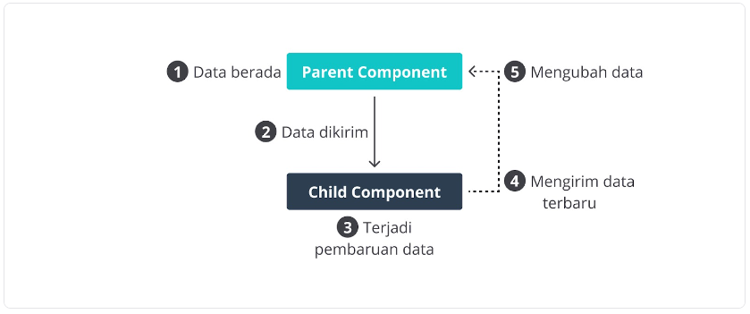

# Belajar-Membuat-Aplikasi-Web-dengan-React

Glosarium
B
Babel
Babel merupakan tools open-source yang digunakan untuk mengubah sintaks ECMAScript 2015+ menjadi sintaks yang didukung oleh JavaScript engine versi lama. Babel sering dipakai ketika kita menggunakan sintaks terbaru termasuk sintaks JSX.


C
Class component
Class component merupakan React component yang dibuat menggunakan keyword class dan mewarisi base class React.Component.


E
ESM
ESM (ECMAScript Module) merupakan format modularisasi standar JavaScript.

F
Functional Component
Functional component merupakan React component yang dibuat menggunakan fungsi JavaScript. Agar fungsi JavaScript dapat disebut component ia harus mengembalikan React element dan dipanggil layaknya React component.


Functional Programming
Functional programming merupakan paradigma pemrograman di mana program dibangun melalui orientasi komposisi fungsi.


I
Instance
Dalam dunia pemrograman, instance merupakan objek yang dibentuk melalui sebuah class.


L
Language-agnostic
Dalam dunia pemrograman, language-agnostic merupakan istilah untuk paradigma pemrograman yang dapat diterapkan di banyak bahasa, atau tidak terpaku pada bahasa tertentu.


Lifecycle
Dalam konteks React component, lifecycle merupakan kumpulan method yang menjadi siklus hidup mulai dari component dibuat (constructor), dicetak (render), pasca-cetak (componentDidMount), dan sebagainya.
 

M
Modularization
Dalam konteks pemrograman JavaScript, modularization merupakan teknik dalam memecah atau menggunakan kode dalam berkas JavaScript secara terpisah berdasarkan tanggung jawabnya masing-masing.


Module Bundler
Dalam konteks pemrograman JavaScript, module bundler merupakan tools yang digunakan untuk menggabungkan seluruh modul JavaScript yang digunakan oleh aplikasi menjadi satu berkas.


O
OAuth
OAuth merupakan mekanisme standar untuk proses autentikasi yang memberikan hak akses tanpa perlu memberikan password.


P
Package
Dalam konteks JavaScript, package merupakan modul third-party yang dapat dimanfaatkan oleh developer untuk mengembangkan aplikasi agar lebih cepat karena tidak perlu membuat kode dari awal.


Platform Agnostic
Dalam dunia pemrograman, platform agnostic merupakan istilah untuk teknologi yang dapat diterapkan tanpa memandang platform tertentu secara spesifik.


Pure Function
Pure function merupakan salah satu konsep di dalam paradigma Functional Programming di mana sebuah fungsi menghasilkan nilai sama bila diberi argumen yang sama dan fungsi tidak boleh menimbulkan efek samping.


R
Render
Dalam konteks React, render merupakan salah satu method lifecycle di component yang berfungsi untuk menyetak UI ke platform baik web atau perangkat native.


T
Transpiler
Dalam konteks JavaScript, transpiler merupakan tools yang berfungsi untuk mengubah kode menjadi kode dalam bentuk atau versi lain. Babel merupakan contoh Transpiler yang terkenal di JavaScript.


W
Webpack
Webpack merupakan salah satu tools module bundler untuk JavaScript dan sering digunakan untuk proyek aplikasi React.


Pengantar Konsep Dasar React
Konsep di dalam React menjadi alasan mengapa kami menganggap React begitu spesial dan jatuh hati dengannya. Di awal pemelajaran, kami ingin Anda mengenal konsep dasar yang ada di React. Hal ini esensial untuk dipelajari karena semakin Anda memahaminya, semakin mudah dan nyaman ketika menggunakan React.

Modul ini akan mengenalkan konsep yang ada di dalam React seperti:

Composition,
Declarative Code,
Unidirectional Data Flow, dan
React tak lebih dari JavaScript.
Sudah tidak sabar? Yuk, kita mulai.

### Composition
Anda mungkin sudah terbiasa memecah kode yang kompleks menjadi fungsi terpisah agar kode lebih mudah dibaca. Jika fungsi mengembalikan sebuah data, Anda juga mungkin terbiasa menggabungkan beberapa fungsi untuk menciptakan data yang lebih kompleks. Contohnya seperti ini.

```
function getProfilePicture(userId) {
 return `https://avatars.githubusercontent.com/u/${userId}`;
}

function getProfileLink(username) {
 return `https://github.com/${username}`;
}


function getGithubInfo(username, userId) {
 return {
   profilePicture: getProfilePicture(userId),
   profileLink: getProfileLink(username),
 };
}

console.log(getGithubInfo('dimasmds', 25724809));

/**
* output:
 {
   profilePicture: 'https://avatars.githubusercontent.com/u/25724809',
   profileLink: 'https://github.com/dimasmds'
 }
*/
```

***Proses menggabungkan banyak fungsi untuk menciptakan data yang lebih kompleks dinamakan composition (komposisi). Di React, praktik komposisi seperti ini menjadi fondasi dan membuatnya menjadi sangat luar biasa.***

***Praktik komposisi di React biasa ditemukkan ketika pembuatan dan penggunaan sebuah component. Component di React bersifat reusable dan dapat dikomposisikan untuk menciptakan component yang lebih kompleks.***

### Declarative Code
Salah satu konsep yang ada di React adalah menulis kode secara deklaratif. Mungkin Anda pernah mendengar istilah tersebut dan membandingkan dengan kode imperatif. Untuk memahami keduanya dengan jelas, kami akan menggunakan perumpamaan yang biasa terjadi di kehidupan nyata.

### Unidirectional Data Flow

Sebelum React, Front-End Framework seperti Angular menggunakan pola two-way data binding untuk aliran data agar ia tetap sinkron dengan DOM (tampilan aplikasi). 


***Jika model mengubah data, data tersebut secara reaktif akan memperbarui data yang ada di view. Sebaliknya, jika pengguna mengubah data yang ada di view, data yang ada di model pun secara reaktif akan berubah. Pola aliran data seperti ini sebenarnya ciamik, tetapi terkadang menyulitkan ketika aplikasi sudah bertambah besar. Karena tak jarang developer bingung dari mana sebetulnya pembaruan data berasal. Dari view-kah? Atau model?***

Berbeda halnya dengan React, aliran data di React bersifat unidirectional atau searah dari parent component (komponen induk) ke child component (komponen anak).



Di React, data terletak di parent component dan bila child component membutuhkannya, data tersebut akan dikirim dari parent component. Ketika terjadi perubahan data, parent component-lah yang dapat memperbarui datanya karena memang datanya berada di sana. Child hanya bisa mengirimkan data terbaru atau memberikan sinyal bila data perlu diperbarui oleh parent component. Ingat! Karena React bersifat reaktif, bila terjadi perubahan data di parent component, child component pun akan memiliki data terbaru.

Oke, untuk memantapkan pemahaman, mari kita tebak-tebakkan.

Anggaplah, Anda memiliki komponen bernama Delivery, di dalamnya terdapat dua child component bernama LocationPicker dan element input bertipe number. Kemudian di dalam komponen LocationPicker, terdapat dua child component bernama OriginPicker dan DestinationPicker. Dengan begitu strukturnya tampak seperti ini.

<Delivery>
 
  <LocationPicker>
    <OriginPicker />
    <DestinationPicker />
  </LocationPicker>
 
  <input type="number"/>
</Delivery>
Dari kode di atas, kira-kira komponen apa saja yang bertanggung jawab untuk memperbarui data? Ingat petunjuknya adalah data hanya berada di parent element.

Jawabannya adalah komponen Delivery dan LocationPicker. Mengapa? Berikut penjelasannya.

Delivery: Karena komponen Delivery merupakan parent dan ia menampung seluruh child component yang membentuk antarmuka pengiriman maka hanya komponen delivery yang cocok untuk memiliki seluruh data pengiriman dan juga bertanggung jawab untuk memperbaruinya.

LocationPicker:  Walaupun LocationPicker menerima data dari induknya, ternyata ia juga merupakan parent component dan sangat masuk akal bila menampung data yang dibutuhkan oleh kedua child component di dalamnya.

Selain kedua komponen tersebut, komponen lain hanyalah child element yang datanya dikirim dari parent. Jadi, mereka tidak bisa memperbarui datanya.

